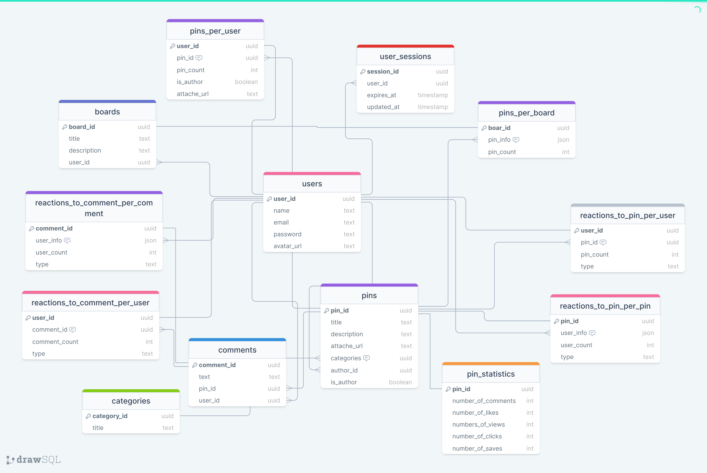
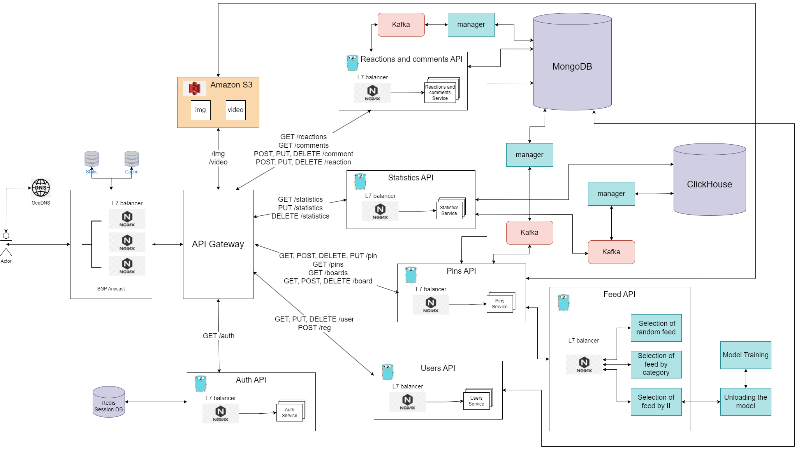

#  Pinterest
### Course Work On Highload

## 1. Тема и целевая аудитория
**Pinterest** - фотохостинг, позволяющий пользователям добавлять в режиме онлайн изображения, помещать их в тематические коллекции и делиться ими с другими пользователями

### MVP

- Регистрация/авторизация
- Просмотр пинов
- Комментирование пинов
- Добавление реакции на пин
- Создание пинов
- Создание собственных досок и сохранение в них пинов

### Целевая аудитория
MAU составляет 450M/ Весь мир

#### Лучшие страны мира по количеству пользователей Pinterest по состоянию на 2023 год

| **Страна** | **Количество, млн** |
|------------|---------------------|
| USA        | 84.6                |
| Brazil     | 28.05               |
| Mexico     | 19.45               |
| Germany    | 15.88               |
| France     | 10.65               |
| Canada     | 8.44                |

Что касается целевой аудитории:
- 55% пользователей составляют люди в возрасте от 18 до 34 лет;
- Количество пользователей от 35 до 54 лет — 31%, а 55 лет и старше — 12%;
- Около 70% всех пользователей — женского пола, мужчины используют социальную сеть намного реже (24%);

### Источники:
- https://www.demandsage.com/pinterest-statistics/
- https://tengyart.ru/statistika-pinterest-v-2020-informacziya-o-auditorii/?ysclid=lmf3csx7nl463560350

## 2. Расчёт нагрузки

### Продуктовые метрики

- Месячная аудитория 450 млн
- Дневная аудитория 225 млн
- Средний размер хранилища пользователя:  
  
Так как Pinterest не предоставляет никакой информации о количестве пинов у одного пользователя,
то возьмём, что в среднем у одного пользователя их 50 штук.  
Пины это файлы в формате .jpg или .mp4, то есть видео и изображения.  
Максимальный размер последних Pinterest установил 20 Mb, то есть будем считать, что в среднем изображение будет весить 10 Mb.  
Видео же должны быть размером меньше 100 Mb, то есть в среднем будут весить 50 Mb.  
На основе информации с данного сайта https://buffer.com/resources/pinterest-marketing-study/ видно, что 99% пинов
это изображения и всего лишь 1% видео.  
Тогда средний размер хранилища пользователя:

```azure
49 * 10 Mb + 1 * 50 Mb = 540 Mb
```

- Среднее количество действий пользователей по типам в день:  
  
С 2022 по 2023 года аудитория Pinterest возросла на 17 млн, то есть в день в среднем регистрировались 46,6 тысяч раз.
Авторизацию же проходят в среднем 4 раза в год, поэтому в день авторизацию проходят в среднем примерно 2,5 млн раз.  
Если взять в расчёт, что один пользователь в среднем смотрит около 50 пинов, то выходит, что в день просматривают
пины около 11 млрд раз.  
Один пользователь комментируют обычно 3 пина в день, тогда комментируют в день 675 млн раз в целом.  
Реакции ставят чаще, около 10 в день, следовательно их добавляют на пины в день около 2 млрд раз.  
Что касается создания пинов, то рядовой пользователь делает это крайне редко,
этим чаще всего занимаются различные юридические лица. Поэтому будем считать, что в день это совершается всего 0,5 раз, 
отсюда получаем, что в день создают пины 112,5 млн раз.  
Создание досок у обычного пользователя происходит в среднем 1 раз в месяц, поэтому в целом 7,5 млн раз.
Что не скажешь о добавлении пинов, в среднем пользователь может сохранить около 5 пинов в день,
то есть в итоге получим около 1 млрд раз.  

| **Действие**          | **Среднее количество в день, штук** |
|-----------------------|-------------------------------------|
| Регистрация           | 46.6 тысяч                          |
| Авторизация           | 2.5 млн                             |
| Просмотр пинов        | 11 млрд                             |
| Комментирование пинов | 675 млн                             |
| Добавление реакции    | 2 млрд                              |
| Создание пина         | 112.5 млн                           |
| Создание досок        | 7.5 млн                             |
| Сохранение пинов      | 1 млрд                              |

### Технические метрики

#### Хранилище

- Регистрация  
  
Здесь основную часть будут занимать аватарки пользователей, средний вес которой равен 5 Мб
За всё время (2009 - 2023): 450 млн пользователей * 5 Мб = 2 146 Тб = 2 Пб  
За год: 2 146 Тб / 14 лет = 153 Тб  
За квартал: 38 Тб  

- Создание пина  
  
Судя по данному источнику
https://aliexpress.inform.click/10-statisticheskih-dannyh-pinterest-kotorye-dolzhen-znat-kazhdyj-marketolog-v-2021-godu-infografika/
в 2019 году у Pinterest было всего около 200 млрд пинов.  
Информацию о том, сколько пинов в среднем добавляет 1 пользователь нет, поэтому возьмём рекомендацию о том, что в среднем
стоит добавлять новых пинов от 1 до 5 пинов (в среднем 3 пина), из источника:
https://www.affde.com/ru/how-many-pinterest-pins-should-i-pin-per-day.html  
Из источника https://www.demandsage.com/pinterest-statistics/ видно, что активных пользователей с 2019 года по 2023 в среднем
было 450 млн, но учитывать будем именно дневную активную аудиторию 225 млн. Тогда с 2019 по 2023 новых пинов примерно появилось:

```azure
4 года * 365 дней * 3 пина * 225 000 000 пользователей = 985,5 млрд пинов
```  

То есть итого сейчас у Pinterest около 1,2 триллиона пинов.  
Как писалось выше, 99% из них это изображения. Отсюда:  
За всё время:  
- Изображения: 1.2 трлн * 0.99 * 10 Mb = 11 064 Пб = 10 Еб (10 эксабайт)
- Видео: 1.2 трлн * 0.01 * 50 Mb = 560 Пб (560 петабайт)
- Итого: 11 564 Пб  
  
За год: 826 Пб  
За квартал: 206.5 Пб  

- Создание комментария 
  
Максимальная длина комментария - 500 символов Unicode, то есть в среднем пусть длина комментария будет 250 символов.
Тогда 1 комментарий будет занимать 500 байт. В день комментируют 675 млн раз. Тогда:  
За квартал: 500 байт * 675 млн * 90 дней = 27 Тб  
За год: 110.5 Тб  
За всё время: 1547 Тб  

Из незначительных по объёму хранилища
- Создание досок: название доски может содержать 50 символов (взято из валидации инпут поля при создании доски),
то есть одна доска будет занимать в среднем 25 * 2 байта = 50 байт
- Добавление реакции на пин: хранить нужно счётчик, id пина, id самой реакции, id статичной картинки реакции
(8 байт + 16 байт + 16 байт + 16 байт = 56 байт)

| **Действие**          | **Объём памяти за всё время** | **Объём памяти за год** | **Объём памяти за квартал** |
|-----------------------|-------------------------------|-------------------------|-----------------------------|
| Регистрация           | 2 Пб                          | 153 Тб                  | 38 Тб                       |
| Комментирование пинов | 1 547 Тб                      | 110.5 Тб                | 27 Тб                       |
| Создание пина         | 11 564 Пб                     | 826 Пб                  | 206.5 Пб                    |

#### Сетевой трафик и rps

Сводная таблица RPS по типовым действиям, средний и пиковый трафики

| **Действие**          | **Тип** | **RPS**  | **RPD**    | **Средний трафик** | **Пиковый трафик** |
|-----------------------|---------|----------|------------|--------------------|--------------------|
| Регистрация           | Запись  | 0.54     | 46.6 тысяч | 2.7 Мб/с           | 5.4 Мб/с           |
| Авторизация           | Чтение  | 3 тыс    | 2.5 млн    | 732 Кб/с           | 1.5 Мб/с           |
| Просмотр пинов        | Чтение  | 127 тыс  | 11 млрд    | 1.2 Тб/с           | 2.4 Тб/с           |
| Комментирование пинов | Запись  | 8 тыс    | 675 млн    | 3.8 Мб/с           | 7.6 Мб/с           |
| Добавление реакции    | Запись  | 23 тыс   | 2 млрд     | 1.2 Мб/с           | 2.4 Мб/с           |
| Создание пина         | Запись  | 1 тыс    | 112.5 млн  | 9.8 Гб/с           | 19.6 Гб/с          |
| Создание досок        | Запись  | 86       | 7.5 млн    | 4.2 Кб/с           | 8.4 Кб/с           |
| Сохранение пинов      | Запись  | 11.6 тыс | 1 млрд     | 113 Гб/с           | 226 Гб/с           |

Пояснение для таблицы:
- RPD взято из пункта выше Среднее количество действий пользователей по типам в день
- RPS = RPD / 86400. Здесь 86400 = 24 часа * 60 минут * 60 секунд
- Средний трафик = RPS * <Вес сообщения из пункта выше Хранилище>
- Пиковый трафик = <Средний трафик> * <Коэффициент отношения пикового трафика к среднему = 2 (на основе данного источника: https://buffer.com/resources/pinterest-scheduling-frequency-timing/ )>  

## 3. Глобальная балансировка нагрузки

### Расположение датацентров

Из источника https://www.demandsage.com/pinterest-statistics/ ясно, что основные пользователи Pinterest находятся
в таких регионах, таких как Северная Америка, Южная Америка, Европа и Азия (а именно Япония).  
Поэтому датацентры Pinterest будут в: Сан-Франциско, Нью-Йорк (как одни из крупнейших городов США), Берлин (является ключевым городом в Европе), 
Индзай (находится неподалёку от Токио, крупнейшего города мира и технологического центра Японии), Сан-Паулу (крупнейший город в Бразилии и имеет крупнейшую экономику в регионе, а Бразилия находится на втором месте по количеству пользователей Pinterest).

### Глобальная балансировка

Балансировка нагрузки будет осуществляться следующим образом:  
**GeoDNS**: для определения местоположения клиента на основе его географических данных,
что позволяет направить его к наиболее близкому серверному центру в соответствующем регионе.  

**BGP Anycast**: для определения ближайшего серверного центра в данном регионе,
что обеспечивает эффективное распределение нагрузки.

## 4. Локальная балансировка нагрузки

### Схемы балансировки для входящих и меж сервисных запросов

Будем использовать L7-балансировку на NGINX на отдельных серверах, так как это позволит кэшировать статику
(которой будет немало) и динамику, есть SSL терминация (сертификаты SSL можно получить из Let's Encrypt),
присутствует сжатие GZIP (что также важно для Pinterest). Также за счёт L7-балансировки мы можем поделить сервисы по
обработке какого-либо конкретного функционала или же по категориям пинов (учитывая их огромное количество).

### Схема отказоустойчивости

У L7-балансировки присутствует пассивная проверка состояния серверов. Однако у NGINX есть минус в том, что ему долго
даются большие конфиги и при этом не поддерживает динамическое обновление конфигурации. Для этого можно использовать
Envoy, который способен читать большие измененные конфигурационные файлы без необходимости перезапуска.
Также следует верно настроить timeout для разных типов запросов, чтобы долго не ожидать статуса о том, что сервер не работает.

## 5. Логическая схема БД

Ссылка на [ER_диаграмму](https://drawsql.app/teams/bashkirs/diagrams/pinterest-v-2)



## 6. Физическая схема БД

### Индексы

- Индекс по заголовку пина в таблице "Пины" (Text индекс)

- Индекс по ID пина в таблице "Комментарии" (Хэш-индекс)

- Индекс по ID юзера в таблице "Комментарии" (Хэш индекс)

- Индекс по типу реакции в таблице "Реакции на комментарии по пину"  (B-tree индекс)

- Индекс по типу реакции в таблице "Реакции на пины по пину"  (B-tree индекс)

### Денормализация

Приведена на [ER-диаграмме](https://drawsql.app/teams/bashkirs/diagrams/pinterest-v-2)

### Выбор СУБД (потаблично)

- Redis (key-value хранилище) будем использовать для хранения сессий пользователей (user_sessions)
- ClickHouse (колоночная база данных, разработанная для обработки аналитических запросов) будем использовать для таблицы pin_statistics
- MongoDB (реляционная база данных) будем использовать для оставшихся таблиц
- Amazon S3 (служба хранения данных в облаке) будем использовать для хранения аттачей (изображение, видео) 

### Шардирование (потаблично)

 - Pins по pin_id
 - Users по user_id
 - Pins_per_user по user_id
 - Boards_per_pin по pin_id
 - Pins_per_board по board_id
 - Comments по pin_id
 - Reactions_to_pin_per_pin по pin_id
 - Reactions_to_pin_per_user по user_id
 - Reactions_to_comment_per_user по user_id
 - Reactions_to_comment_per_comment по comment_id
 - Board_per_pin по pin_id
 - Pins_per_board по board_id

### Клиентские библиотеки / интеграции

Язык бэкенда - Go, отталкиваясь от этого были выбраны следующие коннекторы/библиотеки:
- gocql (https://github.com/gocql/gocql) - Go пакет, официальный драйвер для Cassandra, предоставленный DataStax
- mongo-go-driver (https://www.mongodb.com/docs/drivers/go/current/) - официальный драйвер MongoDB для Go 
- Redigo (https://github.com/gocql/gocql) - популярная библиотека для работы с Redis в Go
- go-clickhouse - коннектор для языка Go, который позволяет взаимодействовать с базой данных ClickHouse  
- AWS SDK (https://pkg.go.dev/github.com/aws/aws-sdk-go) - Software Development Kit (пакет разработки программного обеспечения), предоставляемый Amazon Web Services (AWS), который позволяет разработчикам взаимодействовать с Amazon S3  

## 7. Алгоритмы

#### Рекомендации пинов в ленте

Для этой цели будет использовано несколько отдельных сервиса. Каждый из них будет реализовывать свою методику рекомендаций для определённого места в ленте. То есть лента будет разделена на некоторое количество
блоков, каждый из которых будет запрашивать подборку пинов в своём отдельном сервисе. Пусть у нас будет реализовано 2 сервиса. Первый сервис может рекомендовать пины по просмотренным ранее категориям. Второй же будет выдавать похожие категории за счёт опыта других пользователей, это можно сделать, используя обученную нейросеть.  

#### Поиск определённого пина

Так как только для этой цели Elastic Search использовать не совсем целесообразно, будем реализовывать поиск следующим образом:
- Используя параметр $search и text индексы, получаем полнотекстовый поиск по названию и категории пина. На данном шаге выведется уже часть пинов, которая по смыслу лучше всего подходит под искомую строку
- Затем уже, используя только параметр $regex, получаем уже полноценный частичный поиск, который выведет все остальные частично схожие пины. Данная операция будет происходить дольше первой, поэтому её результаты будут выводится после пинов от первого шага.

## 8. Технологии
 
### Backend сервис
Реализовываться будет на языке Go. Его конкуренты: Java, C++, Python, Rust, C#. Основные преимущества Go:
1. Производительность
2. Простота разработки
3. Масштабируемость
4. Надежность
5. Богатая стандартная библиотека
6. Большое коммьюнити
7. Простая параллельность: горутины и каналы, что облегчает разработку многопоточных программ.

Будет использована микросервисная архитектура на основе Бизнес-сервисов. Можно выделить следующие миркосервисы: сервис авторизации и регистрации, сервис управления пинами, сервис реакций и комментариев, сервис статистики.
Основные преимущества микросервисной архитектуры:
  - Ускорение разработки
  - Повышение надежности
  - Повышение гибкости
  - Повышение управляемости
Минусы:
 - Увеличение накладных расходов. Можем сократить их за счёт gRPC общения между микросервисами
 - Риск overengineering — для нашего небольшого MVP приложения это не так страшно

Почему именно на основе Бизнес-сервисов? Это логичное и понятное разделение сервиса, удобное для дальнейшего интегрирования новых микросервисов

### Frontend
Будет реализован на React, TypeScript. Основной конкурент React-а это Vue. Но он появился позже, а также нет специальной платформы для создания мобильных приложений. В отличие от React, у него есть платформа React Native, которая хорошо интегрируется с React-ом. TypeScript же нужен для строгой типизации, что позволяет отсечь быстрее часть ошибок во время разработки. Одним из конкурентов TS является Flow. Flow - это инструмент статической типизации для JavaScript, разработанный Facebook. Он похож на TypeScript и предлагает подобные возможности статической типизации. Однако TypeScript имеет более широкую поддержку и сообщество разработчиков, что делает его более популярным выбором.

### Балансировщик
Будет использоваться NGINX, так как это позволит кэшировать статику (которой будет немало) и динамику, есть SSL терминация (сертификаты SSL можно получить из Let's Encrypt),
присутствует сжатие GZIP (что также важно для Pinterest). Его основной конкурент это Envoy.
Был взят Nginx, так как это один из наиболее популярных серверов web-прокси с более чем 20-летней историей с большим сообществом и опытом использования в продакшн средах.

### Оркестратор
На данный момент в нём нет никакой необходимости, однако в будущем, с ростом сервиса и бизнес-задач оркестратор можно будет интегрировать для более удобного взаимодействия между микросервисами

### Брокер сообщений
Можно будет использовать его для записи статистики по количеству просмотров пинов, их сохранений, количества реакций, комментариев.
Для данных функций можем использовать Kafka. Взял его, так как RabbitMQ и Celery имеют недостаточную производительность для больших нагрузок. В данном случае Kafka новее, более производительнее, имеет больше возможностей.

### База данных
В качестве основной базы данных была выбрала MongoDB. И основным её конкурентом являлась Cassandra. Cassandra и MongoDB - это две популярные распределенные базы данных, которые предназначены для хранения больших объемов данных и обладают определенными характеристиками, делающими их подходящими для различных сценариев использования. После прочтения [данного источника](https://habr.com/ru/companies/otus/articles/690924/) можно понять, что обе БД достаточно гибки, чтобы соответствовать требованиям бизнеса. И ту, и другую используют довольно известные компании. Однако стоит отталкиваться от того, что Cassandra - колоночная база данных, а MongoDB - документоориентированная. Поэтому для приведённой выше логической схемы БД лучше использовать именно MongoDB. Также стоит отметить, что MongoDB даёт нам консинстентность данных в отличие от Cassandra.

## 9. Схема проекта



## 10. Обеспечение надёжности

### Резервирование
- Резервирование физических компонетов (сервера, диски и т.д.)  
Резервирование физических компонентов включает в себя запасные серверы, диски и другие аппаратные средства, которые могут быть включены в работу в случае отказа основных компонентов. В данном приложении применяется L7-балансировка, которая и будет распределять между несколькими серверами.
- Резервирование ДЦ
  Резервирование ДЦ предполагает наличие нескольких географически расположенных центров обработки данных, которые могут служить как резервные копии друг друга. Это используется за счёт BGP Anycast: для определения ближайшего серверного центра в данном регионе, что обеспечивает эффективное распределение нагрузки ([Расположение датацентров](https://github.com/BigBullas/Course_Work_On_Highload#расположение-датацентров)).
- Резервирование БД - репликация  
  Резервирование БД с помощью репликации позволяет создать копию базы данных, которая автоматически обновляется с основной БД. Это обеспечивает сохранность данных и позволяет продолжать работу даже в случае отказа основной базы данных. В аналоге Пинтереста можно использовать механизм репликации БД для создания резервной копии, которая будет автоматически синхронизироваться с основной БД.
- Резервирование логики
  При выводе пинов вместо отображения рекомендательных пинов (то есть похода на сервис с алгоритмом рекомендации) отобразить случайные пины.

### Сегментирование
- Будет реализвано за счёт микросервисной архитектуры на основе Бизнес-сервисов. Были выделены следующие миркосервисы: сервис авторизации и регистрации, сервис управления пинами, сервис реакций и комментариев, сервис статистики. Тем самым делаем так, чтобы проблемы с запросами одной группы, не вызывали проблем в другой.

### Failover policy
- Игнорирование. Как пример, при отказе отображения комментариев или лайков, показывать заглушку отсутствия комментариев или лайков
- Перезапросы. Они используются для обработки временных сбоев или ошибок при общении с внешними сервисами или ресурсами. Например, они могут понадобится при проблемах с сервисом загрузки изображений (Amazon S3).

### Graceful shutdown
- Реализация graceful shutdown позволяет контролировать процесс завершения работы приложения или сервиса. Это позволяет завершить текущие операции, сохранить данные и корректно прервать работу. То есть сервер не
получает новые запросы, ожидает закрытия всех активных соединений, чтобы завершить свою работу. Примеры реализации данного паттерна приведены в [этом источнике](https://habr.com/ru/articles/771626/).

### Graceful degradation
- Из [этого источника](https://habr.com/ru/companies/yandex/articles/438606/) становится ясно, что микросервисная архитектура уже частично реализует данный паттерн. Однако если вы хотите деградировать с использованием разделения на сервисы, то очень важно сделать так, чтобы сервисы были независимы друг от друга. Также можно реализовать, как говорилось в вышеприведённом источнике "тыкву" приложения (небольшая заглушка некоторого функционала).

### CQRS
- Это подход к проектированию приложений, который разделяет операции записи (command) и операции чтения (query) на уровне модели данных. В данном приложении будет использоваться брокер сообщений для записи пинов в Amazon S3, а также для записи статистики по количеству просмотров пинов, их сохранений, количества реакций, комментариев. Для данных функций можем использовать Kafka.

### Observability
- Логирование (используется для записи информации о работе программы или системы во время ее выполнения. Записанные логи могут использоваться для поиска и анализа ошибок, отладки работы приложения)
- Мониторинг (отслеживает состояние системы или приложения в реальном времени. Мониторинг может включать в себя измерение производительности, использования ресурсов, наличия ошибок, а также других метрик, важных для работы системы)
- Профилирование (стандартный профилировщик GO — [pprof](https://golangforall.com/ru/post/profiling.html#dlya-chego-nuzhno-profilirovat-kod))

## 11. Расчет ресурсов

### Нагрузка на сервисы

| Сервис       | Пиковый RPS | CPU  |  RAM   |     Net     |
|--------------|:------------|:----:|:------:|:-----------:|
| Auth         | 15 тыс      | 150  | 15 Гб  | 26 Мбит/с   |
| User         | 6 тыс       | 30   |  3 Гб  | 55 Мбит/с   |
| Pins         | 140 тыс     | 1400 | 140 Гб | 20 Тбит/с   |
| Feedback     | 31 тыс      | 310  | 31 Гб  | 80 Мбит/с   |
| Statistics   | 127 тыс     | 1270 | 127 Гб | 19.2 Tбит/с |
| nginx        | 320 тыс     | 640  | 50 Гб  | 40 Тбит/с   |

#### Пояснения для таблицы:

- Auth: дневная аудитория - 225 млн, каждый человек заходит в среднем 3 раза в день. Помним про пиковый коэффициент 2. Получаем пиковый RPS (15 тысяч). 114 байт - средний вес сообщения для Auth. Отсюда и получим Net: 15000 * 114 байт * 2 = 26 Мбит/с
- Для остальных сервисов данные были взяты из раздела Технические метрики.

### Конфигурация серверов

| Сервис     | Хостинг | Конфигурация                                       | Cores | Cnt | Покупка, € | Аренда (мес), € |
|------------|---------|----------------------------------------------------|-------|-----|------------|----------------|
| Auth       | own     | 1xAMD EPYC 7443P/2x8ГБ 3200MHz DDR4/1xNVMe256Gb    | 24    | 7   | 4500       | 450             |
| User       | own     | 1xAMD EPYC 7443P/2x8ГБ 3200MHz DDR4/1xNVMe256Gb    | 24    | 2   | 4500       | 450             |
| Pins       | own     | 2xAMD EPYC 7773X/2x16ГБ 3200MHz DDR4/2xNVMe4T      | 128   | 12  | 14 000     | 650             |
| Feedback   | own     | 2x6338/2x16GB/1xNVMe256Gb/2x25Gb/s                 | 64    | 5   | 8 000      | 500             |
| Statistics | own     | 1xAMD EPYC 9754/4x64ГБ 4200MHz DDR5/4xHDD2.4Tb     | 128   | 10  | 17 800     | 700             |
| nginx      | own     | 2x6338/4x8GB/2xNVMe4T/2x25Gb/s                     | 64    | 10  | 8 000      | 500              |


Посчитаем, сколько потребуется денег в сумме за покупку всех серверов:

```azure
4500 * 9 + 14 000 * 12 + 8 000 * 5 + 17 800 * 10 + 8 000 * 10 ≈ 500 000 €  
```  

Посчитаем, сколько потребуется денег в сумме на аренду всех серверов за 5 лет:

```azure
(450 * 9 + 650 * 12 + 500 * 5 + 700 * 10 + 500 * 10) * 12 * 5 ≈ 1 600 000 €
```  

Отсюда делаем вывод, что купить свои серверы выгоднее, чем брать их в аренду. Но стоит отметить, что всё зависит от бизнеса, так как сразу достать 500 000 € намного сложнее, чем платить в месяц где-то 26 350 €.

###### Вот так как то:)
